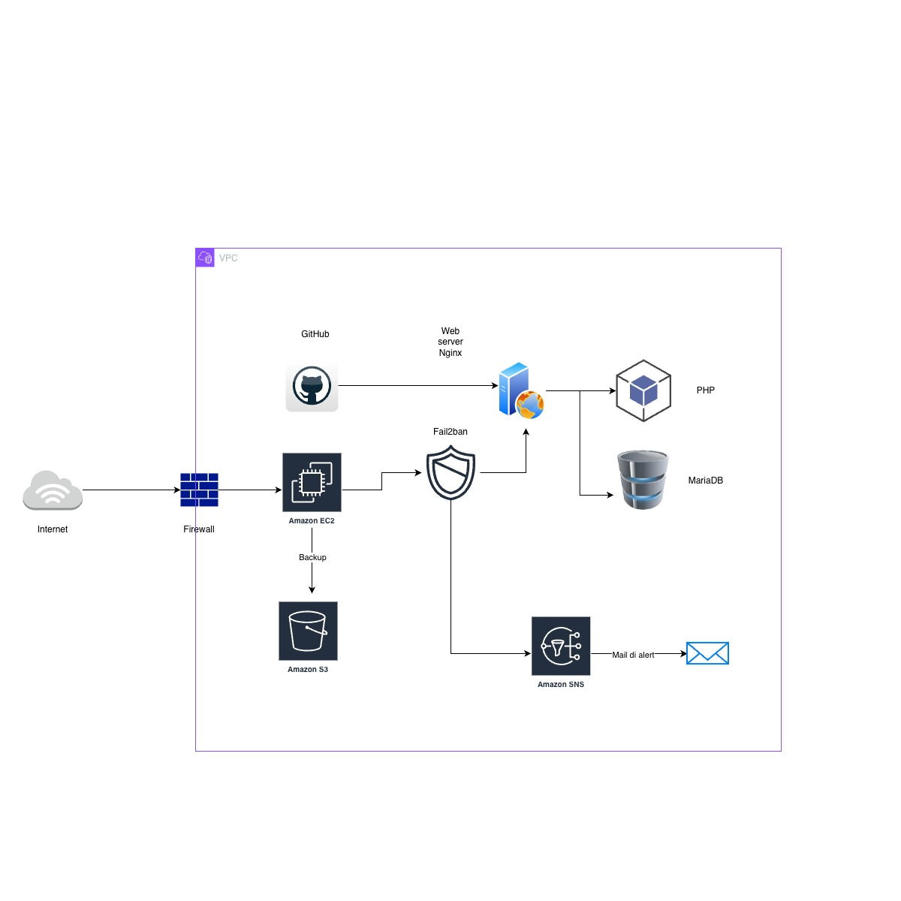

# Project Work – Architettura Web Sicura con Backup, Monitoraggio e Notifiche SNS
**Autore:** Luca Mele  
**Data:** Dicembre 2025  

## Descrizione del progetto
Questo Project Work ha l’obiettivo di realizzare una piccola architettura sistemistica basata su un server Ubuntu con Nginx, dotata di:
- Pubblicazione di una pagina web statica tramite GitHub → Nginx
- Backend PHP con login e database MariaDB
- Sistema di backup automatico su AWS S3
- Monitoraggio attivo dei log
- Sistema di alert via Amazon SNS
- Rilevazione e blocco di tentativi di brute-force tramite Fail2ban
  
Il risultato finale è un ambiente funzionante, testato e sicuro, con processi automatici di notifica e backup.


---

## 1. Requisiti

### Software necessari
- Ubuntu Server 22.04 o superiore  
- Nginx  
- PHP + PHP-FPM + PHP-MySQL  
- MariaDB  
- Git  
- AWS CLI  
- Fail2ban  

### Credenziali richieste
- Account GitHub  
- Account AWS (IAM con accesso a S3 e SNS)  
- Topic SNS attivo  

---

## 2. Setup del Sistema

### 2.1 Aggiornamento del server

```bash
sudo apt update && sudo apt upgrade -y
```
### 2.2 Installazione di Nginx
```bash
sudo apt install nginx -y
```

Verifica servizio:
```bash
systemctl status nginx
```

### 2.3 Pubblicazione della pagina HTML da GitHub
Scaricare il sito statico:
```bash
sudo git clone https://github.com/<username>/<repo>.git /var/www/sito
```
Impostare permessi:
```bash
sudo chown -R www-data:www-data /var/www/sito
sudo chmod -R 755 /var/www/sito
```
Configurazione base in /etc/nginx/sites-available/default:
```pgsql
root /var/www/sito;
index index.html index.htm;
```

## 3. Backend PHP + Database MariaDB

### 3.1 Installazione PHP
```bash
sudo apt install php php-fpm php-mysql -y
```

### 3.2 Installazione MariaDB
```bash
sudo apt install mariadb-server -y
sudo mysql_secure_installation
```

Creazione database:
```sql
CREATE DATABASE login_test;
USE login_test;

CREATE TABLE users (
    id INT AUTO_INCREMENT PRIMARY KEY,
    username VARCHAR(50) UNIQUE,
    password VARCHAR(255)
);

INSERT INTO users(username, password)
VALUES ('admin', PASSWORD('password123'));
```

### 3.3 Configurazione Nginx per PHP
```bash
sudo nano /etc/nginx/sites-available/sito
```
Impostare:
```nginx
location ~ \.php$ {
    include snippets/fastcgi-php.conf;
    fastcgi_pass unix:/run/php/php8.3-fpm.sock;
}
```

Test configurazione:
```bash
sudo nginx -t
```

Ricaricare:
```bash
sudo systemctl reload nginx
```

## 4. Backup automatico su S3

### 4.1 Installazione AWS CLI
```bash
sudo apt install unzip -y
curl "https://awscli.amazonaws.com/awscli-exe-linux-x86_64.zip" -o "awscliv2.zip"
unzip awscliv2.zip
sudo ./aws/install
```

### 4.2 Configurazione credenziali
```bash
aws configure
```

### 4.3 Script backup (backup_S3.sh)

Lo script:

- comprime /var/www/sito
- carica l’archivio nel bucket S3
- registra il log dell’operazione

Esempio di pianificazione via cron:
```bash
crontab -e
```
Aggiungere:
```ruby
0 * * * * /home/ubuntu/backup_S3.sh >> /home/ubuntu/backup_cron.log 2>&1
```

## 5. Monitoraggio dei log + Alert SNS

### 5.1 Creazione topic SNS
```bash
aws sns create-topic --name login-alerts
```

### 5.2 Iscrizione email
```bash
aws sns subscribe \
--topic-arn arn:aws:sns:eu-west-1:xxxx:login-alerts \
--protocol email \
--notification-endpoint tua@email.it
```

Lo script monitor_log.sh analizza in tempo reale:

- /var/log/nginx/access.log
- intercetta tentativi falliti
- incrementa un contatore per IP
- invia una notifica SNS al superamento della soglia

Variabile soglia:
```ini
THRESHOLD=5
```
Avvio script:
```bash
./monitor_log.sh
```

## 6. Protezione da brute-force con Fail2ban

### 6.1 Installazione
```bash
sudo apt install fail2ban -y
```

### 6.2 Filtro personalizzato
File:
```pgsql
/etc/fail2ban/filter.d/nginx-login.local.conf
```
Esempio:
```ini
[Definition]
failregex = ^<HOST> - - .*"(POST|GET) /login_test\.php.*" 200
```

### 6.3 Jail personalizzato

File:
```pgsql
/etc/fail2ban/jail.d/nginx-login.local
```
```ini
[nginx-login]
enabled = true
port = http,https
filter = nginx-login
logpath = /var/log/nginx/access.log
bantime = 60
findtime = 60
maxretry = 3
action = sns[name=login-test]
```

### 6.4 Test Fail2ban
```bash
sudo fail2ban-client status nginx-login
```

## 7. Test dell’infrastruttura

### Test login

- tentativi validi
- tentativi con password errata
- verifica dei log

### Test brute-force
```bash
./brute.sh
```

### Test Fail2ban
```bash
sudo fail2ban-client status nginx-login
```

### Test SNS
Controllare la ricezione dell’email di alert.

## 8. Struttura del progetto
```pgsql
/var/www/sito/
  ├── index.html
  ├── login.php
  ├── login_test.php
  ├── brute.sh

backup_S3.sh
monitor_log.sh

/etc/fail2ban/filter.d/nginx-login.local.conf
/etc/fail2ban/jail.d/nginx-login.local
/etc/fail2ban/action.d/sns.conf
```

## 9. Note finali

- Tutti i test sono stati eseguiti su un'istanza EC2 AWS.
- Per evitare blocchi AWS, è stato utilizzato login_test.php come endpoint di test.
- La soluzione è estensibile con HTTPS, metriche CloudWatch e WAF per maggiore sicurezza.
